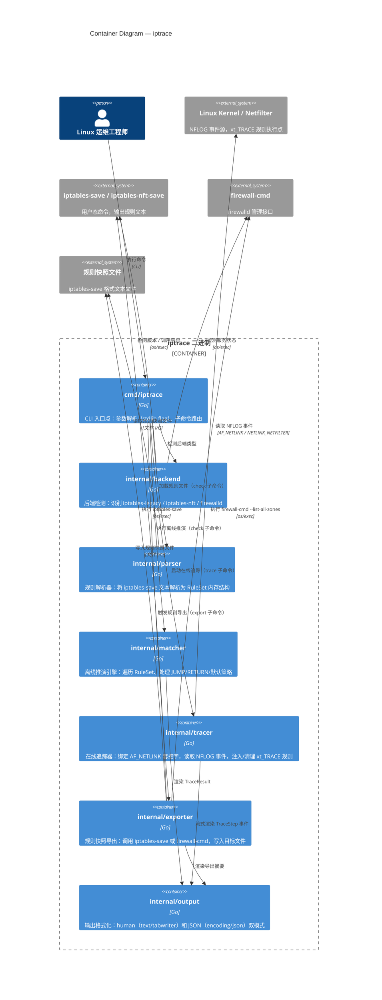

# C4 Container Diagram: iptrace

**Layer**: L2 — Containers  
**Trigger**: Multiple processes (CLI process, kernel Netfilter subsystem, optional external daemons)  
**Generated by**: speckit-architect skill  

