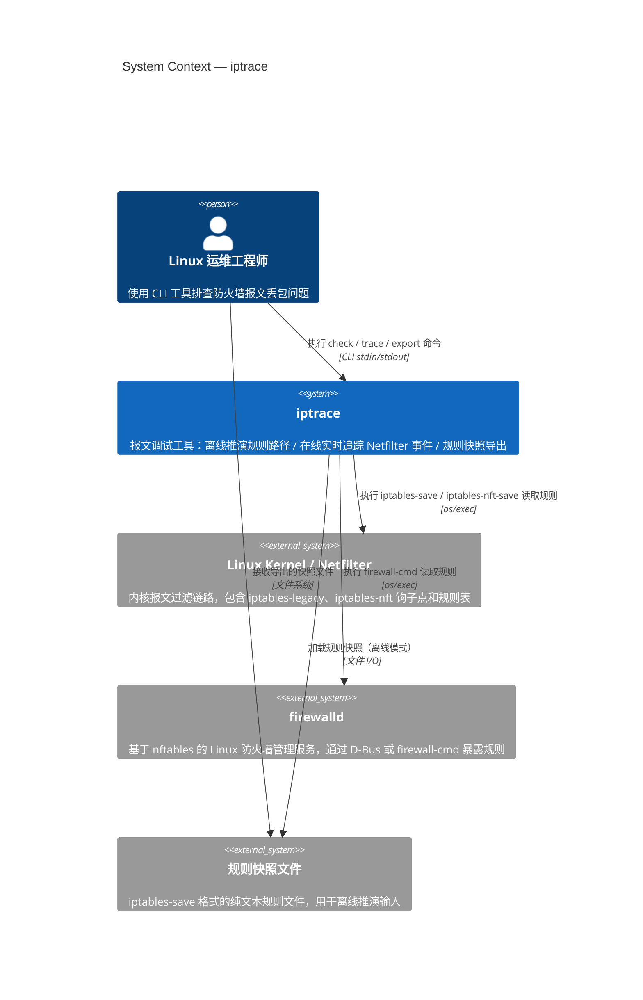

# C4 Context Diagram: iptrace

**Layer**: L1 — System Boundary  
**Trigger**: External actors (Linux user, kernel Netfilter subsystem)  
**Generated by**: speckit-architect skill  

```mermaid
C4Context
  title System Context — iptrace

  Person(user, "Linux 运维工程师", "使用 CLI 工具排查防火墙报文丢包问题")

  System(iptrace, "iptrace", "报文调试工具：离线推演规则路径 / 在线实时追踪 Netfilter 事件 / 规则快照导出")

  System_Ext(kernel_netfilter, "Linux Kernel / Netfilter", "内核报文过滤链路，包含 iptables-legacy、iptables-nft 钩子点和规则表")
  System_Ext(firewalld, "firewalld", "基于 nftables 的 Linux 防火墙管理服务，通过 D-Bus 或 firewall-cmd 暴露规则")
  System_Ext(rules_file, "规则快照文件", "iptables-save 格式的纯文本规则文件，用于离线推演输入")

  Rel(user, iptrace, "执行 check / trace / export 命令", "CLI stdin/stdout")
  Rel(iptrace, kernel_netfilter, "读取 Netfilter NFLOG 追踪事件（在线模式）", "AF_NETLINK socket")
  Rel(iptrace, kernel_netfilter, "执行 iptables-save / iptables-nft-save 读取规则", "os/exec")
  Rel(iptrace, firewalld, "执行 firewall-cmd 读取规则", "os/exec")
  Rel(iptrace, rules_file, "加载规则快照（离线模式）", "文件 I/O")
  Rel(user, rules_file, "接收导出的快照文件", "文件系统")
```
