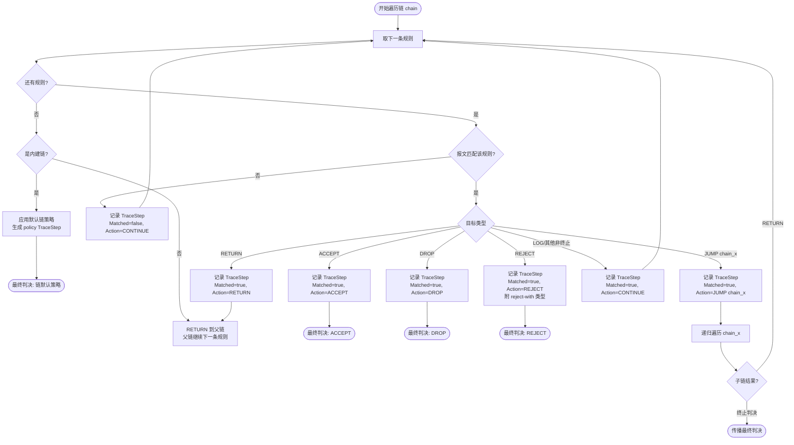

# Flowchart: Rule Traversal Logic

**Layer**: Dynamic — Conditional decision paths  
**Trigger**: ≥3 conditional decision paths in offline rule traversal  
**Scenario**: `internal/matcher` — 单报文在一条链上的规则遍历逻辑  
**Generated by**: speckit-architect skill  

