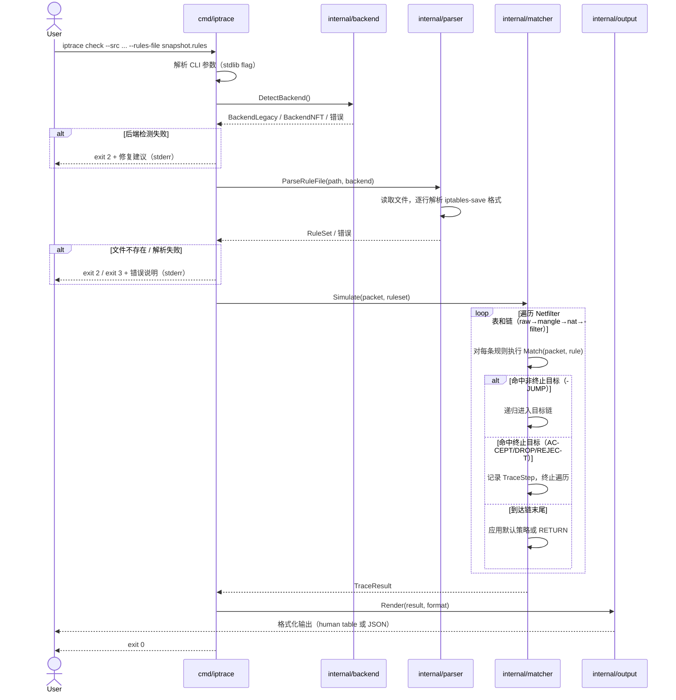

# Sequence Diagram: Offline Check Flow

**Layer**: Dynamic — Cross-component calls  
**Trigger**: Cross-component calls (cmd → backend → parser → matcher → output)  
**Scenario**: US1 — 用户执行 `iptrace check` 离线推演  
**Generated by**: speckit-architect skill  

