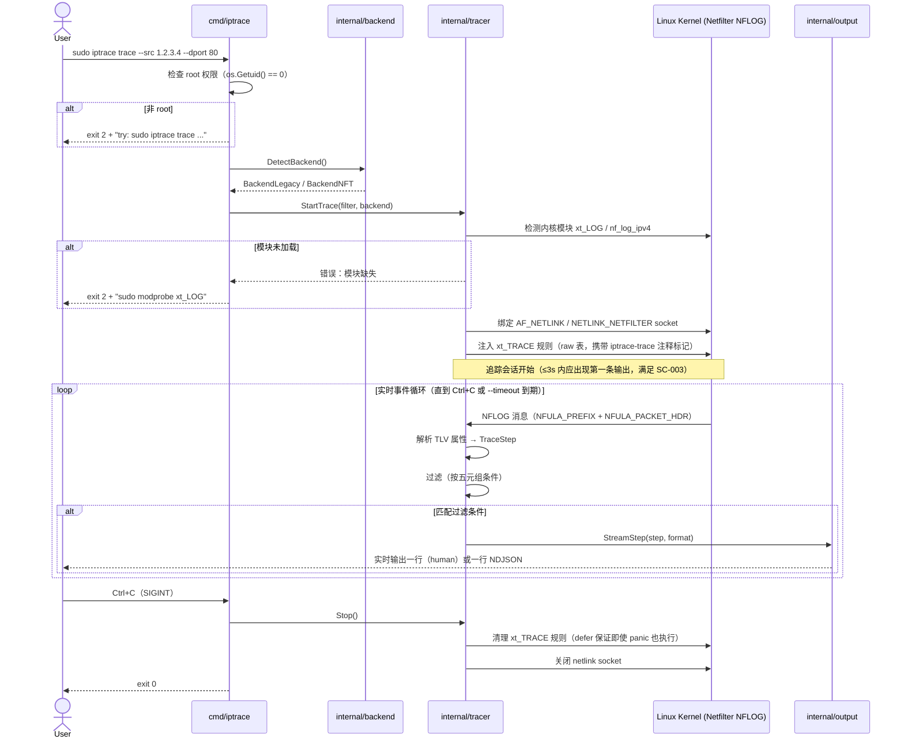

# Sequence Diagram: Online Trace Flow

**Layer**: Dynamic — Cross-component calls  
**Trigger**: Cross-component calls (cmd → tracer → kernel NFLOG → output)  
**Scenario**: US2 — 用户执行 `iptrace trace` 在线追踪  
**Generated by**: speckit-architect skill  

