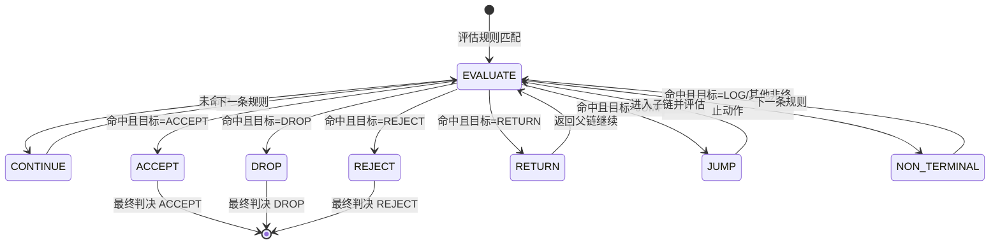

# 状态图：TraceStep 动作状态转换

**Layer**: Dynamic — stateDiagram-v2  
**Trigger**: TraceStep 存在明确动作状态与转换规则  
**Scenario**: `internal/matcher` 中单条规则命中后的动作流转

```mermaid
stateDiagram-v2
    [*] --> EVALUATE: 评估规则匹配

    EVALUATE --> CONTINUE: 未命中
    EVALUATE --> ACCEPT: 命中且目标=ACCEPT
    EVALUATE --> DROP: 命中且目标=DROP
    EVALUATE --> REJECT: 命中且目标=REJECT
    EVALUATE --> RETURN: 命中且目标=RETURN
    EVALUATE --> JUMP: 命中且目标=JUMP <chain>
    EVALUATE --> NON_TERMINAL: 命中且目标=LOG/其他非终止动作

    CONTINUE --> EVALUATE: 下一条规则
    NON_TERMINAL --> EVALUATE: 下一条规则

    JUMP --> EVALUATE: 进入子链并评估
    RETURN --> EVALUATE: 返回父链继续

    ACCEPT --> [*]: 最终判决 ACCEPT
    DROP --> [*]: 最终判决 DROP
    REJECT --> [*]: 最终判决 REJECT
```
